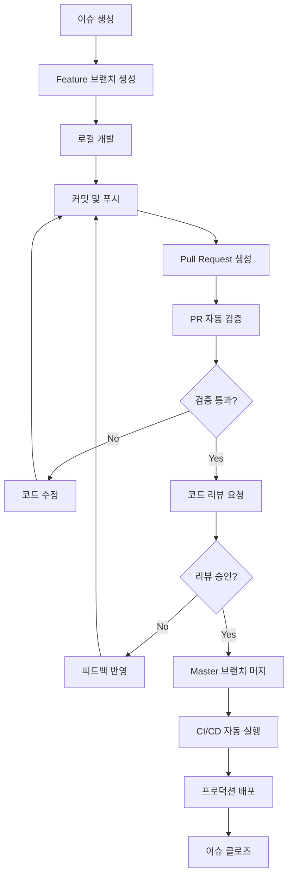
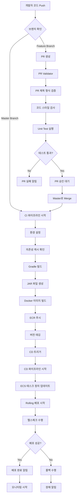

# ECS Backend Production Service

Spring Boot 기반의 REST API 서비스로, AWS ECS(Elastic Container Service)에서 운영되는 프로덕션 환경을 위한 백엔드 애플리케이션입니다. 이 프로젝트는 완전 자동화된 CI/CD 파이프라인을 통해 코드 품질 관리부터 프로덕션 배포까지 모든 과정을 체계적으로 관리합니다.

## 📋 목차

- [아키텍처 개요](#-아키텍처-개요)
- [GitHub Flow 개발 가이드](#-github-flow-개발-가이드)
- [CI/CD 파이프라인](#-cicd-파이프라인)
- [프로젝트 구조](#-프로젝트-구조)
- [Docker 컨테이너화](#-docker-컨테이너화)
- [AWS ECS 배포](#-aws-ecs-배포)
- [개발 환경 설정](#-개발-환경-설정)
- [운영 가이드](#-운영-가이드)
- [트러블슈팅](#️-트러블슈팅)

## 🏗️ 아키텍처 개요

### 기술 스택 상세

#### 백엔드 기술
- **Java 17 (OpenJDK)**: LTS 버전으로 장기 안정성과 성능 최적화 제공
- **Spring Boot 3.5.6**: 최신 Spring Framework 기반 REST API 구현
- **Spring Data Redis**: Redis와의 효율적인 데이터 통신 및 캐시 관리
- **Apache Commons Pool2**: Redis 연결 풀 관리로 성능 최적화

#### 빌드 및 배포
- **Gradle (Kotlin DSL)**: 모던한 빌드 스크립트와 의존성 관리
- **Docker Multi-stage Build**: 경량화된 프로덕션 이미지 생성
- **AWS ECS (Fargate)**: 서버리스 컨테이너 오케스트레이션 플랫폼
- **Amazon ECR**: 프라이빗 Docker 이미지 레지스트리

#### 테스트 및 품질 관리
- **JUnit 5**: 단위 테스트 프레임워크
- **Testcontainers**: 통합 테스트용 컨테이너 기반 테스트 환경
- **GitHub Actions**: CI/CD 파이프라인 자동화

### 시스템 아키텍처

```
                    인터넷
                       │
                       ▼
            ┌─────────────────────┐
            │   Application       │
            │   Load Balancer     │ ← AWS ALB (Application Load Balancer)
            │   (ALB)            │
            └─────────────────────┘
                       │
                       ▼
      ┌─────────────────────────────────────────┐
      │            AWS ECS Cluster              │
      │  ┌─────────────────┐ ┌─────────────────┐ │
      │  │   ECS Service   │ │   ECS Service   │ │ ← 다중 가용영역
      │  │   (AZ-1a)      │ │   (AZ-1c)      │ │
      │  │                │ │                │ │
      │  │ ┌─────────────┐ │ │ ┌─────────────┐ │ │
      │  │ │ Fargate     │ │ │ │ Fargate     │ │ │
      │  │ │ Task        │ │ │ │ Task        │ │ │
      │  │ │ (Container) │ │ │ │ (Container) │ │ │
      │  │ └─────────────┘ │ │ └─────────────┘ │ │
      │  └─────────────────┘ └─────────────────┘ │
      └─────────────────────────────────────────┘
                       │
                       ▼
      ┌─────────────────────────────────────────┐
      │          Redis Cluster                  │
      │  ┌─────────────────┐ ┌─────────────────┐ │
      │  │   Primary       │ │   Replica       │ │ ← 고가용성
      │  │   Node          │ │   Node          │ │
      │  └─────────────────┘ └─────────────────┘ │
      └─────────────────────────────────────────┘
```

### 네트워크 아키텍처

```
VPC (10.0.0.0/16)
├── Public Subnet (10.0.1.0/24)  ← ALB, NAT Gateway
├── Private Subnet (10.0.2.0/24) ← ECS Tasks
└── Private Subnet (10.0.3.0/24) ← Redis, RDS
```

## 🔄 GitHub Flow 개발 가이드

우리 프로젝트는 GitHub Flow를 기반으로 한 개발 워크플로우를 따릅니다. 이는 안전하고 효율적인 협업을 위한 체계적인 프로세스입니다.

### 개발 워크플로우 전체 과정



### 1. 이슈 기반 개발

#### 이슈 생성 가이드

**이슈 템플릿 활용**:
```markdown
## 📝 작업 내용
- [ ] Redis 캐시 TTL 설정 기능 구현
- [ ] API 응답 시간 개선
- [ ] 단위 테스트 작성

## 🎯 목표
사용자 데이터 조회 성능을 50% 향상시킨다

## 📋 상세 설명
현재 Redis 캐시에 TTL이 설정되어 있지 않아 메모리 누수가 발생하고 있습니다.
적절한 TTL(Time To Live) 설정을 통해 캐시 효율성을 개선해야 합니다.

## ✅ 완료 조건 (Definition of Done)
- [ ] Redis TTL 설정 구현
- [ ] 단위 테스트 커버리지 80% 이상
- [ ] 성능 테스트 통과
- [ ] 코드 리뷰 승인
- [ ] 문서 업데이트
```

**이슈 라벨링 시스템**:
- `feature`: 새로운 기능 개발
- `bug`: 버그 수정
- `enhancement`: 기존 기능 개선
- `refactor`: 코드 리팩토링
- `docs`: 문서 작업
- `test`: 테스트 관련
- `hotfix`: 긴급 수정

### 2. 브랜치 전략

#### 브랜치 명명 규칙

```bash
# 기능 개발
feature/TEMPLATE-123-redis-cache-ttl
feature/TEMPLATE-124-api-performance-improvement

# 버그 수정
bugfix/TEMPLATE-125-memory-leak-fix
bugfix/TEMPLATE-126-connection-timeout

# 핫픽스 (긴급 수정)
hotfix/TEMPLATE-127-critical-security-patch

# 리팩토링
refactor/TEMPLATE-128-service-layer-cleanup
```

#### 브랜치 생성 및 관리

```bash
# 1. 최신 master 브랜치로 체크아웃
git checkout master
git pull origin master

# 2. 새 기능 브랜치 생성
git checkout -b feature/TEMPLATE-123-redis-cache-ttl

# 3. 개발 작업 수행
# ... 코딩 ...

# 4. 커밋 (의미있는 단위로)
git add .
git commit -m "feat: Redis TTL 설정 기능 구현

- RedisConfig에서 기본 TTL 30분 설정
- CacheService에서 동적 TTL 지원
- 관련 단위 테스트 추가

Resolves: #123"

# 5. 원격 브랜치에 푸시
git push -u origin feature/TEMPLATE-123-redis-cache-ttl
```

### 3. 커밋 메시지 컨벤션

#### Conventional Commits 규칙

```bash
<type>[optional scope]: <description>

[optional body]

[optional footer(s)]
```

**커밋 타입**:
- `feat`: 새로운 기능 추가
- `fix`: 버그 수정
- `docs`: 문서 수정
- `style`: 코드 스타일 변경 (포맷팅, 세미콜론 누락 등)
- `refactor`: 코드 리팩토링
- `test`: 테스트 추가 또는 수정
- `chore`: 빌드 프로세스 또는 보조 도구 변경

**좋은 커밋 메시지 예시**:
```bash
feat(redis): TTL 설정 기능 구현

- RedisTemplate에서 expire() 메서드 활용
- 환경별 TTL 설정 지원 (dev: 5분, prod: 30분)
- null safety 검증 로직 추가

Breaking Change: 기존 캐시 데이터는 자동으로 만료됩니다.

Closes: #123
Co-authored-by: John Doe <john@example.com>
```

### 4. Pull Request 프로세스

#### PR 생성 전 체크리스트

```bash
# 로컬 테스트 실행
./gradlew clean test

# 코드 스타일 검사
./gradlew checkstyleMain

# 로컬 빌드 확인
./gradlew bootJar

# 최신 master와 충돌 확인
git checkout master
git pull origin master
git checkout feature/TEMPLATE-123-redis-cache-ttl
git rebase master  # 또는 git merge master
```

#### PR 템플릿

```markdown
## 🎯 작업 내용
[TEMPLATE-123] Redis 캐시 TTL 설정 기능 구현

## 📋 변경 사항
- Redis TTL 설정 기능 추가
- CacheService 클래스 리팩토링
- 관련 단위 테스트 추가

## 🧪 테스트 계획
- [ ] 단위 테스트 통과 확인
- [ ] 통합 테스트 수행
- [ ] 성능 테스트 실행
- [ ] 수동 QA 테스트

## 🔗 관련 이슈
Closes #123

## 📸 스크린샷 (UI 변경 시)
<!-- 스크린샷 첨부 -->

## 📝 리뷰어를 위한 참고사항
- Redis TTL 기본값은 30분으로 설정했습니다
- 환경변수로 TTL 값을 조정할 수 있습니다
- 기존 캐시 데이터는 새로운 TTL 적용을 위해 삭제됩니다

## ✅ PR 체크리스트
- [ ] 코드가 의도한 대로 동작하는가?
- [ ] 새로운 기능에 대한 테스트가 추가되었는가?
- [ ] 문서가 업데이트되었는가?
- [ ] 리팩토링이 필요한 부분은 없는가?
- [ ] 보안 이슈는 없는가?
```

### 5. 자동화된 품질 검증

#### PR Validator (pr-validator.yaml) 상세

우리의 PR 검증 시스템은 다음과 같은 단계로 구성됩니다:

```yaml
name: Pull Request Validator

on:
  pull_request:
    branches: [master]

permissions:
  pull-requests: write
  checks: write

jobs:
  pr-validation:
    runs-on: ubuntu-latest
    name: Validate PR format and quality
    steps:
      - name: Checkout code
        uses: actions/checkout@v4

      # 1. PR 제목 형식 검증
      - name: Check PR title format
        uses: actions/github-script@v7
        with:
          github-token: ${{secrets.GITHUB_TOKEN}}
          script: |
            const pull = context.payload.pull_request
            const titlePattern = /^\[TEMPLATE-\d+\]/
            
            if (!titlePattern.test(pull.title)) {
              core.setFailed(`
                ❌ PR 제목이 올바른 형식을 따르지 않습니다.
                
                현재: ${pull.title}
                예상: [TEMPLATE-123] 기능 설명
                
                올바른 형식:
                [TEMPLATE-123] Redis 캐시 TTL 설정 기능 구현
                [TEMPLATE-124] API 응답 성능 개선
              `)
              return
            }
            
            console.log(`✅ PR 제목 형식이 올바릅니다: ${pull.title}`)

      # 2. PR 크기 검증 (너무 큰 PR 방지)
      - name: Check PR size
        uses: actions/github-script@v7
        with:
          script: |
            const pull = context.payload.pull_request
            const changedFiles = pull.changed_files
            const additions = pull.additions
            const deletions = pull.deletions
            
            const maxFiles = 20
            const maxLines = 1000
            
            if (changedFiles > maxFiles) {
              core.setFailed(`
                ⚠️ PR이 너무 큽니다. 파일 수를 줄여주세요.
                현재: ${changedFiles}개 파일
                권장: ${maxFiles}개 파일 이하
              `)
            }
            
            if (additions + deletions > maxLines) {
              console.log(`
                ⚠️ PR이 큽니다. 가능하면 더 작은 단위로 나누어 주세요.
                현재: +${additions}/-${deletions} 줄
                권장: ${maxLines}줄 이하
              `)
            }

      # 3. 브랜치 명명 규칙 검증
      - name: Check branch naming
        uses: actions/github-script@v7
        with:
          script: |
            const branchName = context.payload.pull_request.head.ref
            const branchPattern = /^(feature|bugfix|hotfix|refactor)\/TEMPLATE-\d+/
            
            if (!branchPattern.test(branchName)) {
              core.setFailed(`
                ❌ 브랜치 이름이 명명 규칙을 따르지 않습니다.
                
                현재: ${branchName}
                
                올바른 형식:
                - feature/TEMPLATE-123-feature-name
                - bugfix/TEMPLATE-124-bug-description
                - hotfix/TEMPLATE-125-critical-fix
                - refactor/TEMPLATE-126-refactor-name
              `)
            }

      # 4. 커밋 메시지 검증
      - name: Validate commit messages
        uses: actions/github-script@v7
        with:
          script: |
            const commits = await github.rest.pulls.listCommits({
              owner: context.repo.owner,
              repo: context.repo.repo,
              pull_number: context.issue.number
            })
            
            const commitPattern = /^(feat|fix|docs|style|refactor|test|chore)(\(.+\))?: .{1,50}/
            const invalidCommits = []
            
            for (const commit of commits.data) {
              const message = commit.commit.message.split('\n')[0]
              if (!commitPattern.test(message)) {
                invalidCommits.push({
                  sha: commit.sha.substring(0, 7),
                  message: message
                })
              }
            }
            
            if (invalidCommits.length > 0) {
              const details = invalidCommits.map(c => 
                `- ${c.sha}: ${c.message}`
              ).join('\n')
              
              core.setFailed(`
                ❌ 다음 커밋 메시지가 컨벤션을 따르지 않습니다:
                
                ${details}
                
                올바른 형식:
                feat: 새로운 기능 추가
                fix: 버그 수정
                docs: 문서 수정
                style: 코드 스타일 변경
                refactor: 코드 리팩토링
                test: 테스트 추가/수정
                chore: 기타 작업
              `)
            }
```

#### Unit Test Runner (test-runner.yaml) 상세

```yaml
name: Unit Test Runner

on:
  push:
    branches: [master]
  pull_request:
    types: [opened, synchronize, reopened]

permissions:
  checks: write
  pull-requests: write
  actions: read

jobs:
  test:
    name: Run tests and quality checks
    runs-on: ubuntu-latest
    
    steps:
      - name: Checkout code
        uses: actions/checkout@v4
        with:
          fetch-depth: 0  # SonarQube 분석을 위한 전체 히스토리

      - name: Set up JDK 17
        uses: actions/setup-java@v4
        with:
          java-version: '17'
          distribution: 'temurin'

      - name: Cache Gradle packages
        uses: actions/cache@v4
        with:
          path: |
            ~/.gradle/caches
            ~/.gradle/wrapper
          key: ${{ runner.os }}-gradle-${{ hashFiles('**/*.gradle*', '**/gradle-wrapper.properties') }}
          restore-keys: |
            ${{ runner.os }}-gradle

      - name: Make gradlew executable
        run: chmod +x gradlew

      # 1. 코드 스타일 검사
      - name: Run code style check
        run: |
          ./gradlew checkstyleMain checkstyleTest
          echo "✅ 코드 스타일 검사 완료"

      # 2. 컴파일 검사
      - name: Compile code
        run: |
          ./gradlew compileJava compileTestJava
          echo "✅ 컴파일 완료"

      # 3. 단위 테스트 실행
      - name: Run unit tests
        run: |
          ./gradlew test --continue --info
          echo "✅ 단위 테스트 완료"

      # 4. 통합 테스트 실행 (Testcontainers 포함)
      - name: Run integration tests
        run: |
          ./gradlew integrationTest --continue --info
          echo "✅ 통합 테스트 완료"

      # 5. 테스트 커버리지 생성
      - name: Generate test coverage report
        run: |
          ./gradlew jacocoTestReport
          echo "✅ 커버리지 리포트 생성 완료"

      # 6. 테스트 결과 발행
      - name: Publish test results
        uses: EnricoMi/publish-unit-test-result-action@v2
        if: always()
        with:
          files: |
            build/test-results/**/*.xml
          comment_mode: create new
          check_name: "Unit Test Results"

      # 7. 커버리지 코멘트 추가
      - name: Add coverage comment
        uses: madrapps/jacoco-report@v1.6.1
        if: github.event_name == 'pull_request'
        with:
          paths: build/reports/jacoco/test/jacocoTestReport.xml
          token: ${{ secrets.GITHUB_TOKEN }}
          min-coverage-overall: 70
          min-coverage-changed-files: 80
          title: 'Code Coverage Report'
          update-comment: true

      # 8. 보안 취약점 스캔
      - name: Run security scan
        run: |
          ./gradlew dependencyCheckAnalyze
          echo "✅ 보안 스캔 완료"

      # 9. 빌드 산출물 생성 테스트
      - name: Build JAR
        run: |
          ./gradlew bootJar
          echo "✅ JAR 빌드 완료"

      # 10. 테스트 실패 시 상세 로그 업로드
      - name: Upload test logs
        uses: actions/upload-artifact@v4
        if: failure()
        with:
          name: test-logs
          path: |
            build/reports/
            build/test-results/
          retention-days: 5
```

### 6. 코드 리뷰 가이드라인

#### 리뷰어 체크리스트

**기능성 검토**:
- [ ] 코드가 요구사항을 정확히 구현하는가?
- [ ] 엣지 케이스가 적절히 처리되는가?
- [ ] 에러 핸들링이 충분한가?

**코드 품질 검토**:
- [ ] 코드가 읽기 쉽고 이해하기 쉬운가?
- [ ] 적절한 네이밍 컨벤션을 따르는가?
- [ ] 중복 코드가 없는가?
- [ ] SOLID 원칙을 따르는가?

**테스트 검토**:
- [ ] 단위 테스트가 충분한가?
- [ ] 테스트가 의미있는 시나리오를 커버하는가?
- [ ] 테스트 코드가 명확하고 유지보수 가능한가?

**성능 및 보안 검토**:
- [ ] 성능에 부정적인 영향은 없는가?
- [ ] 보안 취약점은 없는가?
- [ ] 메모리 누수 가능성은 없는가?

#### 리뷰 코멘트 예시

**좋은 리뷰 코멘트**:
```markdown
💡 **개선 제안**: 
현재 캐시 키 생성 로직이 여러 곳에 중복되어 있네요. 
별도의 유틸리티 클래스로 추출하는 것이 어떨까요?

```java
public class CacheKeyUtils {
    public static String generateUserCacheKey(Long userId) {
        return String.format("user:%d", userId);
    }
}
```

🔍 **질문**: 
Redis TTL을 30분으로 설정한 특별한 이유가 있나요? 
비즈니스 요구사항에 따라 조정이 필요할 것 같습니다.

✅ **승인**: 
로직이 명확하고 테스트도 잘 작성되었습니다. LGTM!
```

### 7. 배포 가이드

#### 배포 시나리오별 가이드

**시나리오 1: 일반적인 기능 배포**
```bash
1. Feature 브랜치 개발 완료
2. PR 생성 및 자동 검증 통과
3. 코드 리뷰 및 승인
4. Master 브랜치 머지
5. CI 파이프라인 자동 실행
6. CD 파이프라인 자동 실행
7. 프로덕션 배포 완료
```

**시나리오 2: 핫픽스 배포**
```bash
1. Hotfix 브랜치 생성 (master에서 직접)
2. 긴급 수정 및 최소한의 테스트
3. PR 생성 (빠른 리뷰 요청)
4. 긴급 승인 및 머지
5. 즉시 배포 실행
6. 배포 후 모니터링 강화
```

**시나리오 3: 대규모 변경 배포**
```bash
1. Feature 브랜치에서 개발
2. 스테이징 환경 배포 및 QA
3. 성능 테스트 수행
4. 카나리 배포 검토
5. 점진적 배포 실행
6. 모니터링 및 롤백 준비
```

#### 배포 전 체크리스트

**기술적 검증**:
- [ ] 모든 테스트 통과 확인
- [ ] 코드 리뷰 완료
- [ ] 의존성 충돌 확인
- [ ] 데이터베이스 마이그레이션 검토
- [ ] 환경 변수 설정 확인

**비즈니스 검증**:
- [ ] 기능 요구사항 충족 확인
- [ ] 사용자 수용 테스트 완료
- [ ] 롤백 계획 수립
- [ ] 모니터링 대시보드 준비
- [ ] 장애 대응팀 대기

### 8. 품질 메트릭 및 모니터링

#### 개발 품질 지표

**코드 품질 메트릭**:
```yaml
목표 지표:
  - 테스트 커버리지: 80% 이상
  - 코드 복잡도: 10 이하 (Cyclomatic Complexity)
  - 코드 중복률: 5% 이하
  - 기술 부채 비율: 5% 이하 (SonarQube 기준)

PR 품질 메트릭:
  - PR 평균 크기: 300줄 이하
  - 리뷰 소요 시간: 24시간 이내
  - 리뷰 참여율: 100%
  - 버그 발견율: PR당 0.1개 이하
```

**자동화 지표**:
```yaml
CI/CD 성능:
  - 빌드 성공률: 95% 이상
  - 테스트 실행 시간: 5분 이하
  - 배포 소요 시간: 10분 이하
  - 배포 성공률: 99% 이상

개발 생산성:
  - 일일 배포 횟수: 3회 이상
  - 평균 리드 타임: 3일 이하
  - 롤백 비율: 5% 이하
  - 장애 복구 시간: 30분 이하
```

## 🚀 CI/CD 파이프라인

우리의 CI/CD 시스템은 GitOps 원칙을 따르며, 코드 변경 시 자동으로 빌드, 테스트, 배포가 수행되는 완전 자동화 파이프라인입니다.

### 전체 파이프라인 플로우



### 1. 코드 품질 관리 (Quality Gate)

#### PR 검증 워크플로우 (pr-validator.yaml)

이 워크플로우는 Pull Request의 품질과 규칙 준수를 보장합니다.

**트리거 조건**:
```yaml
on:
  pull_request:
    branches: [master]
```

**검증 프로세스**:

1. **PR 제목 형식 검증**
   ```javascript
   // PR 제목이 [TEMPLATE-번호] 형식을 따르는지 확인
   const titlePattern = /^\[TEMPLATE-\d+\]/
   
   if (!titlePattern.test(pull.title)) {
     core.setFailed(`PR 제목이 [TEMPLATE-번호] 형식을 따르지 않습니다.`)
   }
   ```
   - 예시: `[TEMPLATE-123] Redis 캐시 기능 추가`
   - 목적: PR 추적성과 릴리즈 노트 자동 생성

2. **코드 스타일 검사**
   - Checkstyle 또는 SpotBugs 실행
   - 코딩 컨벤션 준수 확인
   - 보안 취약점 스캔

#### 테스트 실행 워크플로우 (test-runner.yaml)

모든 코드 변경에 대해 포괄적인 테스트를 수행합니다.

**트리거 조건**:
```yaml
on:
  push:
    branches: [master]
  pull_request:
    types: [opened, synchronize, reopened]
```

**테스트 환경 설정**:
```yaml
- name: Set up JDK 17
  uses: actions/setup-java@v4
  with:
    java-version: 17
    distribution: temurin  # Eclipse Temurin (AdoptOpenJDK)

- name: Cache Gradle packages
  uses: actions/cache@v4
  with:
    path: ~/.gradle/caches
    key: ${{ runner.os }}-gradle-${{ hashFiles('**/*.gradle*') }}
```

**테스트 실행**:
```bash
# Redis Testcontainer를 포함한 통합 테스트 실행
./gradlew clean test --info

# 테스트 커버리지 리포트 생성
./gradlew jacocoTestReport

# 테스트 결과 발행
EnricoMi/publish-unit-test-result-action@v2
```

**테스트 유형**:
- **Unit Tests**: 개별 컴포넌트 기능 검증
- **Integration Tests**: Redis와의 연동 테스트
- **Testcontainers**: 실제 Redis 컨테이너를 사용한 테스트

### 2. 지속적 통합 (CI) - develop_server_integrator.yaml

#### 빌드 환경 설정

**AWS 인증 (OIDC 기반)**:
```yaml
- name: Configure AWS Credentials
  uses: aws-actions/configure-aws-credentials@v4
  with:
    role-to-assume: arn:aws:iam::949653644001:role/github_Mugeon_ecs_test_OIDC
    role-session-name: GitHubActions-ECS-Deploy-${{ github.run_id }}
    aws-region: ap-northeast-2
```

**JDK 및 Gradle 설정**:
```yaml
- name: Set up JDK 17
  uses: actions/setup-java@v4
  with:
    java-version: '17'
    distribution: 'temurin'

- name: Cache Gradle packages
  uses: actions/cache@v4
  with:
    path: |
      ~/.gradle/caches
      ~/.gradle/wrapper
    key: ${{ runner.os }}-gradle-${{ hashFiles('**/*.gradle*') }}
```

#### 버전 관리 시스템 (HeadVer)

프로젝트는 HeadVer 버전 관리 시스템을 사용합니다:

**버전 형식**: `{head}.{yearweek}.{build_number}`

**구성 요소**:
- `head`: 주요 버전 번호 (수동 입력 또는 기존 태그 기반)
- `yearweek`: 연도(2자리) + 주차(2자리) - 예: 2541 = 2025년 41주차
- `build_number`: GitHub Actions 실행 번호 (자동 증가)

**버전 생성 로직**:
```bash
# 최신 태그 가져오기
latest_tag=$(git describe --tags --abbrev=0 --match "[0-9]*.[0-9]*.[0-9]*" 2>/dev/null || echo "0.0.0")

# HeadVer 버전 생성
IFS='.' read -ra version_parts <<< "$latest_tag"
head=${{ github.event.inputs.head || version_parts[0] }}
yearweek=$(date +%y%W)
build=${{ github.run_number }}
version="${head}.${yearweek}.${build}"

# 예시 결과: 0.2541.135
```

#### Docker 이미지 빌드 및 배포

**ECR 로그인**:
```yaml
- name: Login to Amazon ECR
  id: login-ecr
  uses: aws-actions/amazon-ecr-login@v2
```

**이미지 빌드 및 푸시**:
```bash
# Docker 이미지 빌드 (Multi-stage)
docker build -t $ECR_REGISTRY/$ECR_REPOSITORY:$IMAGE_TAG .

# 두 개의 태그로 푸시
docker tag $ECR_REGISTRY/$ECR_REPOSITORY:$IMAGE_TAG $ECR_REGISTRY/$ECR_REPOSITORY:latest
docker push $ECR_REGISTRY/$ECR_REPOSITORY:$IMAGE_TAG
docker push $ECR_REGISTRY/$ECR_REPOSITORY:latest
```

### 3. 지속적 배포 (CD) - develop_server_deployer.yaml

#### 자동 트리거 시스템

**워크플로우 체이닝**:
```yaml
on:
  workflow_run:
    workflows: ["Develop Server Integrator (CI)"]
    types: [completed]
    branches: [master]
  workflow_dispatch:  # 수동 실행 지원
    inputs:
      version:
        description: 'Image version tag'
        required: true
        default: 'latest'
```

#### 배포 프로세스

**1. 버전 확인 및 이미지 설정**:
```bash
# CI에서 생성된 최신 태그 가져오기
if [ "${{ github.event_name }}" = "workflow_dispatch" ]; then
  VERSION="${{ github.event.inputs.version }}"
else
  LATEST_TAG=$(git describe --tags --abbrev=0 --match "[0-9]*.[0-9]*.[0-9]*")
  VERSION="$LATEST_TAG"
fi

IMAGE_URI="${ECR_REGISTRY}/${ECR_REPOSITORY}:${VERSION}"
```

**2. ECS 태스크 정의 업데이트**:
```yaml
- name: Fill in the new image ID in ECS task definition
  id: task-def
  uses: aws-actions/amazon-ecs-render-task-definition@v1
  with:
    task-definition: ./task-definition.json
    container-name: ecs_be_prod_container
    image: ${{ steps.set-image.outputs.image }}
```

**3. ECS 서비스 배포**:
```yaml
- name: Deploy Amazon ECS task definition
  uses: aws-actions/amazon-ecs-deploy-task-definition@v1
  with:
    task-definition: ${{ steps.task-def.outputs.task-definition }}
    service: ecs_be_prod-service
    cluster: my-cluster
    wait-for-service-stability: true  # 배포 완료까지 대기
```

**4. 배포 태그 생성**:
```javascript
// 배포 성공 시 Git 태그 자동 생성
const version = '${{ steps.set-image.outputs.version }}';
const tag = `ecs-deploy-${version}`;

await github.rest.git.createRef({
  owner: context.repo.owner,
  repo: context.repo.repo,
  ref: `refs/tags/${tag}`,
  sha: context.sha
});
```

### 4. 인프라 구성 상세

#### ECS 클러스터 설정

**클러스터 구성**:
- **이름**: `my-cluster`
- **컴퓨팅 유형**: AWS Fargate (서버리스)
- **네트워킹**: VPC 모드 (awsvpc)
- **가용영역**: 다중 AZ 배포로 고가용성 보장

**서비스 설정**:
```json
{
  "serviceName": "ecs_be_prod-service",
  "cluster": "my-cluster",
  "taskDefinition": "ecs_be_prod",
  "desiredCount": 2,
  "deploymentConfiguration": {
    "maximumPercent": 200,
    "minimumHealthyPercent": 100
  },
  "networkConfiguration": {
    "awsvpcConfiguration": {
      "subnets": ["subnet-xxx", "subnet-yyy"],
      "securityGroups": ["sg-xxx"],
      "assignPublicIp": "DISABLED"
    }
  }
}
```

#### 태스크 정의 상세 분석

```json
{
  "family": "ecs_be_prod",
  "networkMode": "awsvpc",
  "requiresCompatibilities": ["FARGATE"],
  "cpu": "1024",      // 1 vCPU
  "memory": "3072",   // 3 GB RAM
  "executionRoleArn": "arn:aws:iam::949653644001:role/ecsTaskExecutionRole",
  "containerDefinitions": [
    {
      "name": "ecs_be_prod_container",
      "image": "949653644001.dkr.ecr.ap-northeast-2.amazonaws.com/ecs-be-prod:latest",
      "essential": true,
      "portMappings": [
        {
          "containerPort": 8080,
          "protocol": "tcp"
        }
      ],
      "environment": [
        {
          "name": "REDIS_HOST",
          "value": "redis://redis-6379-tcp.my-app:6379"
        },
        {
          "name": "REDIS_PORT", 
          "value": "6379"
        }
      ],
      "logConfiguration": {
        "logDriver": "awslogs",
        "options": {
          "awslogs-group": "/ecs/ecs_be_prod",
          "awslogs-create-group": "true",
          "awslogs-region": "ap-northeast-2",
          "awslogs-stream-prefix": "ecs"
        }
      },
      "healthCheck": {
        "command": [
          "CMD-SHELL",
          "curl -f http://localhost:8080/actuator/health || exit 1"
        ],
        "interval": 30,
        "timeout": 5,
        "retries": 3,
        "startPeriod": 60
      }
    }
  ]
}
```

## 📂 프로젝트 구조

### 디렉토리 구조

```
ecs_be_prod/
├── .github/
│   ├── workflows/
│   │   ├── develop_server_deployer.yaml    # CD 파이프라인
│   │   ├── develop_server_integrator.yaml  # CI 파이프라인
│   │   ├── pr-validator.yaml               # PR 검증
│   │   └── test-runner.yaml                # 테스트 실행
│   └── pull_request_template.md            # PR 템플릿
├── src/
│   ├── main/
│   │   ├── java/me/geon/ecs_be_prod/
│   │   │   ├── EcsBeProdApplication.java   # Spring Boot 메인 클래스
│   │   │   ├── config/
│   │   │   │   └── RedisConfig.java        # Redis 설정
│   │   │   ├── controller/
│   │   │   │   ├── Controller.java         # 기본 REST 컨트롤러
│   │   │   │   └── RedisController.java    # Redis 관련 API
│   │   │   └── service/
│   │   │       └── RedisService.java       # Redis 비즈니스 로직
│   │   └── resources/
│   │       └── application.yml             # 애플리케이션 설정
│   └── test/
│       └── java/me/geon/ecs_be_prod/
│           ├── controller/
│           │   └── RedisControllerIntegrationTest.java
│           └── service/
│               └── RedisServiceTest.java
├── build.gradle.kts                        # Gradle 빌드 설정
├── Dockerfile                              # Multi-stage Docker 빌드
├── docker-redis.yml                        # 로컬 Redis 설정
├── task-definition.json                    # ECS 태스크 정의
├── CLAUDE.md                               # Claude Code 가이드
└── README.md                               # 프로젝트 문서
```

### 주요 파일 상세 설명

#### build.gradle.kts
```kotlin
plugins {
    java
    id("org.springframework.boot") version "3.5.6"
    id("io.spring.dependency-management") version "1.1.7"
}

group = "me.geon"
description = "ecs_be_prod"

java {
    toolchain {
        languageVersion = JavaLanguageVersion.of(17)
    }
}

dependencies {
    // Spring Boot 스타터
    implementation("org.springframework.boot:spring-boot-starter-web")
    implementation("org.springframework.boot:spring-boot-starter-data-redis")
    
    // 연결 풀 관리
    implementation("org.apache.commons:commons-pool2")
    
    // 환경 변수 관리
    implementation("io.github.cdimascio:dotenv-java:3.0.0")
    
    // 테스트 의존성
    testImplementation("org.springframework.boot:spring-boot-starter-test")
    testImplementation("org.testcontainers:junit-jupiter:1.19.8")
    testImplementation("org.testcontainers:testcontainers:1.19.8")
    testRuntimeOnly("org.junit.platform:junit-platform-launcher")
}
```

#### application.yml
```yaml
spring:
  application:
    name: ecs_be_prod
  data:
    redis:
      host: ${REDIS_HOST}
      port: ${REDIS_PORT}
      timeout: 2000ms
      lettuce:
        pool:
          max-active: 8    # 최대 활성 연결
          max-idle: 8      # 최대 유휴 연결
          min-idle: 0      # 최소 유휴 연결
          max-wait: -1ms   # 무제한 대기

management:
  endpoints:
    web:
      exposure:
        include: health,info,metrics
  endpoint:
    health:
      show-details: always

logging:
  level:
    me.geon.ecs_be_prod: DEBUG
    org.springframework.data.redis: DEBUG
```

## 📦 Docker 컨테이너화

### Multi-Stage 빌드 전략

우리의 Dockerfile은 2단계 빌드 프로세스를 사용하여 최적화된 프로덕션 이미지를 생성합니다.

#### Stage 1: Build Stage

```dockerfile
FROM --platform=linux/amd64 gradle:8-jdk17 AS build

WORKDIR /app

# Gradle 설정 파일 먼저 복사 (캐시 최적화)
COPY build.gradle.kts settings.gradle.kts gradlew ./
COPY gradle gradle

# 의존성 사전 다운로드 (캐시 레이어)
RUN ./gradlew dependencies --no-daemon

# 소스 코드 복사 및 빌드
COPY . .
RUN ./gradlew bootJar --no-daemon
```

**빌드 단계 최적화 포인트**:
1. **레이어 캐싱**: Gradle 설정 파일을 먼저 복사하여 의존성 변경 시에만 재다운로드
2. **병렬 빌드**: Gradle의 병렬 실행으로 빌드 시간 단축
3. **데몬 비활성화**: 컨테이너 환경에서 불필요한 Gradle 데몬 프로세스 제거

#### Stage 2: Runtime Stage

```dockerfile
FROM --platform=linux/amd64 openjdk:17-jdk-slim

WORKDIR /app

# JAR 파일만 복사 (경량화)
COPY --from=build /app/build/libs/*.jar app.jar

# 포트 노출
EXPOSE 8080

# JVM 옵션 최적화
ENV JAVA_OPTS="-Xms512m -Xmx2048m -XX:+UseG1GC -XX:MaxGCPauseMillis=200"

# 애플리케이션 실행
ENTRYPOINT ["sh", "-c", "java $JAVA_OPTS -jar app.jar"]
```

**런타임 최적화**:
- **G1GC**: 낮은 지연시간을 위한 가비지 컬렉터 사용
- **메모리 설정**: 컨테이너 메모리(3GB)에 맞는 힙 크기 설정
- **슬림 이미지**: JDK Slim으로 불필요한 도구 제거

### 이미지 크기 최적화

| 구성 요소 | 크기 | 설명 |
|-----------|------|------|
| gradle:8-jdk17 (빌드) | ~800MB | 빌드 도구 포함 |
| openjdk:17-jdk-slim | ~400MB | 런타임만 포함 |
| 애플리케이션 JAR | ~50MB | Spring Boot Fat JAR |
| **최종 이미지** | **~450MB** | 프로덕션 최적화 완료 |

## 🚀 AWS ECS 배포

### ECS 서비스 아키텍처

#### 서비스 구성

```yaml
서비스 설정:
  이름: ecs_be_prod-service
  클러스터: my-cluster
  작업 정의: ecs_be_prod
  원하는 작업 수: 2
  
배포 설정:
  최대 백분율: 200%      # 롤링 배포 중 최대 작업 수
  최소 정상 백분율: 100% # 배포 중 최소 유지 작업 수
  
네트워크 설정:
  서브넷: 프라이빗 서브넷 (multi-AZ)
  보안 그룹: 애플리케이션 전용 SG
  공개 IP: 비활성화
```

#### 로드 밸런서 연동

```yaml
Target Group 설정:
  프로토콜: HTTP
  포트: 8080
  헬스체크 경로: /actuator/health
  헬스체크 간격: 30초
  정상 임계값: 2
  비정상 임계값: 5
  
Application Load Balancer:
  리스너: HTTPS (443)
  SSL 인증서: AWS Certificate Manager
  라우팅: 호스트 기반 또는 경로 기반
```

### 배포 전략

#### Rolling 배포 과정

```
1. 새로운 작업 시작
   ├── 새 이미지로 작업 정의 업데이트
   ├── 새 작업 인스턴스 시작 (Fargate)
   └── 컨테이너 초기화 및 헬스체크 시작

2. 헬스체크 수행
   ├── 애플리케이션 시작 확인 (/actuator/health)
   ├── 로드 밸런서 대상 그룹 등록
   └── 트래픽 수신 시작

3. 기존 작업 종료
   ├── 새 작업이 정상 상태 확인
   ├── 기존 작업에서 트래픽 차단
   ├── Connection Draining (30초 대기)
   └── 기존 작업 종료

4. 배포 완료
   ├── 모든 새 작업이 정상 상태
   ├── 서비스 안정성 확인
   └── 배포 태그 생성
```

#### 배포 모니터링

**CloudWatch 메트릭**:
```yaml
서비스 메트릭:
  - CPUUtilization: CPU 사용률
  - MemoryUtilization: 메모리 사용률
  - RunningTaskCount: 실행 중인 작업 수
  - PendingTaskCount: 대기 중인 작업 수

애플리케이션 메트릭:
  - HTTP 응답 시간
  - 요청 처리율 (RPS)
  - 에러율 (4xx, 5xx)
  - Redis 연결 상태
```

### 보안 설정

#### IAM 역할 구성

**ECS 작업 실행 역할** (`ecsTaskExecutionRole`):
```json
{
  "Version": "2012-10-17",
  "Statement": [
    {
      "Effect": "Allow",
      "Action": [
        "ecr:GetAuthorizationToken",
        "ecr:BatchCheckLayerAvailability", 
        "ecr:GetDownloadUrlForLayer",
        "ecr:BatchGetImage",
        "logs:CreateLogGroup",
        "logs:CreateLogStream",
        "logs:PutLogEvents"
      ],
      "Resource": "*"
    }
  ]
}
```

**GitHub Actions OIDC 역할**:
```json
{
  "Version": "2012-10-17",
  "Statement": [
    {
      "Effect": "Allow",
      "Action": [
        "ecs:UpdateService",
        "ecs:DescribeServices",
        "ecs:RegisterTaskDefinition",
        "ecr:GetAuthorizationToken",
        "ecr:BatchCheckLayerAvailability",
        "ecr:GetDownloadUrlForLayer", 
        "ecr:BatchGetImage",
        "ecr:InitiateLayerUpload",
        "ecr:UploadLayerPart",
        "ecr:CompleteLayerUpload",
        "ecr:PutImage"
      ],
      "Resource": "*"
    }
  ]
}
```

#### 네트워크 보안

**보안 그룹 규칙**:
```yaml
애플리케이션 보안 그룹:
  인바운드:
    - 포트 8080 (HTTP): ALB에서만 허용
    - 포트 443 (HTTPS): 외부 접근 허용
  아웃바운드:
    - 포트 6379 (Redis): Redis 보안 그룹으로 제한
    - 포트 443 (HTTPS): 외부 API 호출용

Redis 보안 그룹:
  인바운드:
    - 포트 6379: 애플리케이션 보안 그룹에서만 허용
  아웃바운드:
    - 제한 없음
```


## 🛠️ 개발 환경 설정

### 로컬 개발 환경 구성

#### 필수 소프트웨어

```bash
# Java 17 설치 (Temurin 배포판 권장)
brew install --cask temurin17

# Gradle 설치 (선택사항 - gradlew 사용 권장)
brew install gradle

# Docker 설치
brew install --cask docker

# AWS CLI 설치
brew install awscli

# 개발 도구
brew install --cask intellij-idea
```

#### 환경 변수 설정

`.env` 파일 생성:
```bash
# Redis 설정
REDIS_HOST=localhost
REDIS_PORT=6379

# AWS 설정 (로컬 개발용)
AWS_REGION=ap-northeast-2
AWS_PROFILE=default

# 애플리케이션 설정
SPRING_PROFILES_ACTIVE=local
LOG_LEVEL=DEBUG
```

#### 로컬 Redis 실행

`docker-redis.yml`:
```yaml
version: '3.8'
services:
  redis:
    image: redis:7-alpine
    ports:
      - "6379:6379"
    command: redis-server --appendonly yes
    volumes:
      - redis-data:/data
    environment:
      - REDIS_PASSWORD=
    healthcheck:
      test: ["CMD", "redis-cli", "ping"]
      interval: 30s
      timeout: 10s
      retries: 3

volumes:
  redis-data:
```

실행 명령어:
```bash
# Redis 컨테이너 시작
docker-compose -f docker-redis.yml up -d

# Redis 연결 테스트
redis-cli ping

# Redis 모니터링
redis-cli monitor
```

### 빌드 및 실행 가이드

#### Gradle 빌드

```bash
# 의존성 다운로드
./gradlew dependencies

# 컴파일 및 테스트
./gradlew clean build

# 테스트만 실행
./gradlew test

# 테스트 리포트 확인
open build/reports/tests/test/index.html

# JAR 파일 생성
./gradlew bootJar

# 생성된 JAR 실행
java -jar build/libs/ecs_be_prod-*.jar
```

#### Spring Boot 개발 서버

```bash
# 개발 모드로 실행 (자동 재시작)
./gradlew bootRun

# 특정 프로파일로 실행
./gradlew bootRun --args='--spring.profiles.active=dev'

# 디버그 모드로 실행
./gradlew bootRun --debug-jvm
```

#### Docker 로컬 빌드

```bash
# 이미지 빌드
docker build -t ecs-be-prod:local .

# 컨테이너 실행
docker run -p 8080:8080 \
  -e REDIS_HOST=host.docker.internal \
  -e REDIS_PORT=6379 \
  ecs-be-prod:local

# 컨테이너 로그 확인
docker logs -f <container_id>
```

### IDE 설정 (IntelliJ IDEA)

#### 프로젝트 설정

```xml
<!-- .idea/misc.xml -->
<project version="4">
  <component name="ProjectRootManager" version="2" 
             languageLevel="JDK_17" 
             default="true" 
             project-jdk-name="17" 
             project-jdk-type="JavaSDK">
    <output url="file://$PROJECT_DIR$/out" />
  </component>
</project>
```

#### 코드 스타일 설정

```xml
<!-- .idea/codeStyles/Project.xml -->
<component name="ProjectCodeStyleConfiguration">
  <code_scheme name="Project">
    <JavaCodeStyleSettings>
      <option name="IMPORT_LAYOUT_TABLE">
        <value>
          <package name="java" withSubpackages="true" static="false"/>
          <package name="javax" withSubpackages="true" static="false"/>
          <package name="org" withSubpackages="true" static="false"/>
          <package name="com" withSubpackages="true" static="false"/>
          <package name="" withSubpackages="true" static="false"/>
        </value>
      </option>
    </JavaCodeStyleSettings>
  </code_scheme>
</component>
```

#### 유용한 플러그인

- **Spring Boot**: Spring Boot 지원
- **Docker**: Dockerfile 편집 및 실행
- **AWS Toolkit**: AWS 리소스 관리
- **GitToolBox**: Git 통합 기능 강화
- **SonarLint**: 코드 품질 검사

## 📊 운영 가이드

### 모니터링 시스템

#### CloudWatch 대시보드

**ECS 서비스 메트릭**:
```yaml
대시보드 구성:
  - CPU 사용률 (목표: < 70%)
  - 메모리 사용률 (목표: < 80%)
  - 네트워크 I/O
  - 작업 상태 (Running/Stopped/Pending)
  
알람 설정:
  - CPU 사용률 > 80% (5분간)
  - 메모리 사용률 > 90% (3분간)
  - 작업 실패 횟수 > 0
  - 헬스체크 실패 > 3회
```

**애플리케이션 메트릭**:
```yaml
Spring Boot Actuator 엔드포인트:
  - /actuator/health: 애플리케이션 상태
  - /actuator/metrics: 성능 메트릭
  - /actuator/info: 버전 정보
  - /actuator/prometheus: Prometheus 메트릭
  
커스텀 메트릭:
  - Redis 연결 상태
  - API 응답 시간
  - 비즈니스 메트릭 (요청/처리량)
```

#### 로그 관리

**CloudWatch Logs 구성**:
```yaml
로그 그룹: /ecs/ecs_be_prod
로그 스트림: ecs/{task-id}
보존 기간: 30일 (비용 최적화)

로그 레벨:
  - ERROR: 시스템 오류 및 예외
  - WARN: 경고 메시지
  - INFO: 일반 정보 (요청/응답)
  - DEBUG: 디버깅 정보 (로컬 개발용)
```

**로그 쿼리 예시**:
```sql
-- 에러 로그 검색
fields @timestamp, @message
| filter @message like /ERROR/
| sort @timestamp desc
| limit 100

-- API 응답 시간 분석
fields @timestamp, @message
| filter @message like /ResponseTime/
| stats avg(responseTime) by bin(5m)
```

### 성능 최적화

#### JVM 튜닝

**프로덕션 JVM 옵션**:
```bash
JAVA_OPTS="
  -Xms1024m                          # 초기 힙 크기
  -Xmx2048m                          # 최대 힙 크기
  -XX:+UseG1GC                       # G1 가비지 컬렉터
  -XX:MaxGCPauseMillis=200          # 최대 GC 중지 시간
  -XX:+UseStringDeduplication        # 문자열 중복 제거
  -XX:+PrintGC                       # GC 로그 출력
  -XX:+PrintGCDetails               # 상세 GC 로그
  -Djava.security.egd=file:/dev/./urandom  # 빠른 난수 생성
"
```

**메모리 분석**:
```bash
# 힙 덤프 생성 (문제 발생 시)
jcmd <pid> GC.run_finalization
jcmd <pid> VM.gc
jmap -dump:format=b,file=heapdump.hprof <pid>

# GC 로그 분석
-XX:+PrintGCApplicationStoppedTime
-XX:+PrintGCApplicationConcurrentTime
-Xloggc:/app/logs/gc.log
```


**Redis 모니터링**:
```bash
# Redis 성능 모니터링
redis-cli --latency -h <redis-host> -p 6379
redis-cli --latency-history -h <redis-host> -p 6379

# 메모리 사용량 확인
redis-cli info memory

# 느린 쿼리 로그
redis-cli slowlog get 10
```


**의존성 취약점 검사**:
```bash
# Gradle 의존성 취약점 검사
./gradlew dependencyCheckAnalyze

# OWASP 의존성 검사 리포트
open build/reports/dependency-check-report.html
```

#### 액세스 로그 분석

**ALB 액세스 로그**:
```sql
-- S3에 저장된 ALB 로그 분석 (Athena 쿼리)
SELECT 
  request_url,
  target_status_code,
  COUNT(*) as request_count,
  AVG(target_processing_time) as avg_response_time
FROM alb_logs 
WHERE day = '2024/10/09'
GROUP BY request_url, target_status_code
ORDER BY request_count DESC
```

### 비용 최적화

#### 리소스 사용률 모니터링

**ECS 비용 최적화**:
```yaml
비용 절약 전략:
  1. 적정 크기 조정:
     - CPU/메모리 사용률 모니터링
     - 과도한 리소스 할당 방지
     
  2. 스팟 인스턴스 활용:
     - 개발/테스트 환경에서 Fargate Spot 사용
     - 비용 50-70% 절약 가능
     
  3. 스케줄링 기반 스케일링:
     - 업무 시간 외 인스턴스 수 축소
     - CloudWatch Events + Lambda 활용
```

**모니터링 비용**:
```yaml
CloudWatch 비용 관리:
  - 불필요한 메트릭 비활성화
  - 로그 보존 기간 최적화 (7-30일)
  - 커스텀 메트릭 최소화
  
S3 비용:
  - 로그 파일 lifecycle 정책 설정
  - Intelligent Tiering 활용
  - 압축 및 아카이브 정책
```
